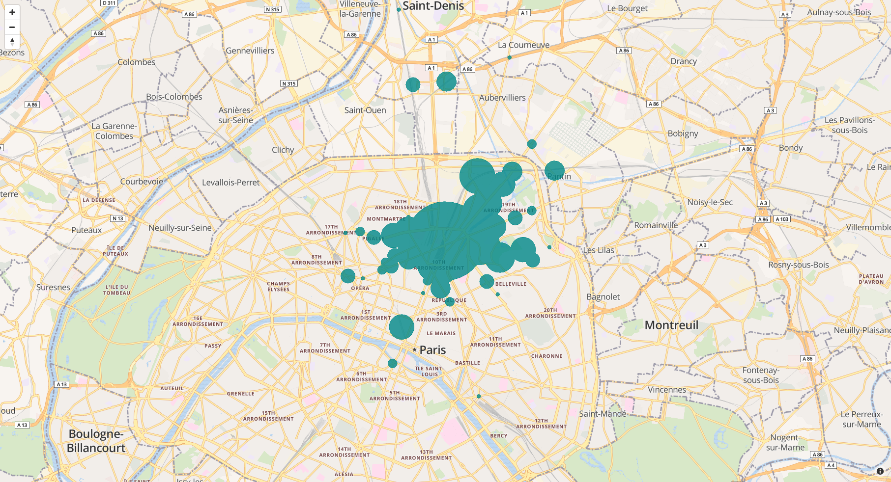

# Isochronous timing

Content:
- [Introduction](#introduction)
- [Settings](#settings)
- [High Level Flow](#high-level-flow)
- [Cache](#cache)
- [Available backends to interact with APIs](#available-backends-to-interact-with-apis)
- [Asynchronous tasks](#asynchronous-tasks)
- [Endpoints](#endpoints)
- [Tests](#tests)


## Introduction

Isochronous timing refers to a sequence of events occurring regularly or at equal time intervals. In our project, it adds the possibility to **search companies by commuting time** instead of distance. For example, a user may ask "Find me offices located at 30 minutes by car from Metz city center".


### Search area

Searching by distance returns a **disc-shaped list of points**, as it uses a **radius** from a given location.


*Generated using [Travel Time Platform](https://www.traveltimeplatform.com/)*

On the contrary, searching by commute time generates several polygon-shaped lists of points. *Why?* Because the unit of measure is no longer a **distance** as the crow flies, which is linear, but **time** required to go from point A to point B. It does not depend on the distance but on many **parameters**: transport mode, infrastructures (Is an office easily reached by bus? Is there a road around and how fast can one drive on it? etc.), public transport interconnections, ... This "breaks up" space and leads to a fragmented action zone: a set of several polygons.


*Reachable zones using public transport in Paris in 30 minutes from city center.*


### APIs and requirements

Our project allows searching by two transport modes: car or public transports. To get isochrone polygons given a certain location, we call two APIs:

- car: [IGN](https://geoservices.ign.fr/documentation/geoservices/isochrones.html)
- public transports: [Navitia](http://doc.navitia.io/#journeys)


Requirements:

- **[Huey](https://huey.readthedocs.io/)**: asynchronous task queue used to cache isochrones and durations.
- **A Redis server** (_optional_): used as a backend for Huey. If enabled, the Redis server is also used to cache isochrone results. This is important in production, as it takes a long time to compute a single isochrone. **Default to local cache**.
- **Elastic Search** search by polygon feature is used to find offices.


## Settings


### In case of emergency

A global switch is available in the settings: `ENABLE_ISOCHRONES`. If turned off, it hides buttons on the front end so that the users are no longer able to filter by commute time.

`labonneboite/templates/search/results/content.html`

```
<div id="distance-duration-switch"
  class="{{ "hidden" if not enable_isochrones else "" }}"
  data-switch-value-selected="{{ "duration" if duration_filter_enabled else "distance"}}">
  ...
</div>
```


### Other useful settings

`labonneboite/conf/common`

```
# Services called to get isochrone polygons.
# Available backends: dummy, ign, navitia, navitia_mock, ign_mock
TRAVEL_VENDOR_BACKENDS = {
    'isochrone': {
        'car': 'ign',
        'public': 'navitia',
    },
    'durations': {
        'car': 'ign',
        'public': 'navitia',
    },
}

# Redis cache (unnecessary if we use local travel cache)
# Useful in production but you need to setup a Redis server!
REDIS_SENTINELS = [] # e.g: [('localhost', 26379)]
REDIS_SERVICE_NAME = 'redis-lbb' # same as declared by sentinel config file
# The following are used only if REDIS_SENTINELS is empty. (useful in
# development where there is no sentinel)
REDIS_HOST = 'localhost'
REDIS_PORT = 6389

# Set this to False to simply trash async tasks (useful in tests)
PROCESS_ASYNC_TASKS = True

# Cache backend
# 'dummy, 'local' or 'redis'
TRAVEL_CACHE = 'local'

# Credentials for fetching travel durations and isochrones
IGN_CREDENTIALS = {
    'key': '',
    'username': '',
    'password': ''
}
NAVITIA_API_TOKEN = 'setme'
```


Constants can be found here: `labonneboite/common/maps/constants`. They define, amongst other things, 3 durations and 2 travel modes:

```
ISOCHRONE_DURATIONS_MINUTES = (15, 30, 45)
DEFAULT_TRAVEL_MODE = CAR_MODE
TRAVEL_MODES = (
    PUBLIC_MODE,
    CAR_MODE,
)
```

:information_source: `ISOCHRONE_DURATIONS_MINUTES` is also used in the search form to display available durations.


## High level flow

### User interface

User is on the search page (`url_for('search.entreprises')`: `/entreprises`). He wants to filter search results by time instead of distance. He clicks on "min" (for "minutes") and then selects the transport mode of its choice:
- :bus: "_Transports en commun_" (public transports)
- :blue_car: **"_Voiture_"** (car) => default

He can also select a duration:
- less than 15 minutes,
- **less than 30 minutes**, => default
- less than 45 minutes,
- more than 45 minutes.

Each time he selects an option (transport mode or duration), a new search is made. Results are displayed on a map and detailed underneath on a list.

### Under the hood

Global view:
1. Precompute isochrone data in a cache.
1. Use this data with Elastic Search to filter offices located inside polygons.
1. Display filtered results to the user.
1. Show commuting time for each office in JS.

#### 1/ Precompute isochrone data in a cache.

When loading the view `search.entreprises`, isochrone results are precomputed:


`labonneboite/web/search/views.py`

```
@searchBlueprint.route('/entreprises')
def entreprises():
    # ...
    # Anticipate future calls by pre-computing duration-related searches
    if location:
        precompute.isochrones((location.latitude, location.longitude))
```

It means that our app retrieves isochrone data for **each two transport modes** and for **each four durations** specified in `labonneboite/common/maps/constants`.

`labonneboite/common/maps/precompute.py`

```
def isochrones(location):
    """
    Compute isochrones asynchronously for all durations and modes. Each isochrone
    is computed in a separate task.
    """
    for mode in travel.TRAVEL_MODES:
        for duration in constants.ISOCHRONE_DURATIONS_MINUTES:
            isochrone(location, duration, mode=mode)
```

:warning: Isochrone data is a list of polygons (a list of lists of coordinates), not Elastic Search results! More precisely, its form is:

```
[
    [
        ({latitude}, {longitude}),
        ({latitude}, {longitude})
    ],
    [...]
]

# Example: `[[(3.504869, 45.910195), (3.504860, 45.910194)], [...]]`
```

:information_source: Data is stored in a cache (see [section Cache](#cache) for further information). The `isochrone` task checks if there is already data for this location in the cache. If not, it stores it.


#### 2/ Use this data with Elastic Search

Elastic Search understands pretty well geometric data, including polygons. We just have to pass it to the Elastic Search query. This is made in two steps:

`labonneboite/web/search/views.py`

```
@searchBlueprint.route('/entreprises')
def entreprises():
    # Convert request arguments to fetcher parameters
    parameters = get_parameters(request.args)

    # Fetch offices and alternatives
    # Other filters are hidden in this documentation for readability purposes.
    fetcher = search_util.HiddenMarketFetcher(
        location,
        travel_mode=parameters['travel_mode'],
        duration=parameters['duration'],
        # ...
    )
```


`labonneboite/common/search.py`

```
def build_json_body_elastic_search(...):
    # ...
    # Add a filter in Elastic Search
    if duration is not None:
        # Retrieve cached data
        isochrone = travel.isochrone((latitude, longitude), duration, mode=travel_mode)
        if isochrone:
            for polygon in isochrone:
                should_filters.append({
                    "geo_polygon": {
                        "locations": {
                            "points": [[p[1], p[0]] for p in polygon]
                        }
                    }
                })
```


#### 3/ Display filtered results to the user

Once results are ready in the `search.entreprises` view, two templates can be shown:
- if request is an AJAX call: `search/results_content.html`
- if not: `search/results.html`


`labonneboite/web/search/views.py`

```
@searchBlueprint.route('/entreprises')
def entreprises():
    # Render different template if it's an ajax call
    template = 'search/results.html' if not request.is_xhr else 'search/results_content.html'
```

Both are located here: `labonneboite/templates/`

:information_source: This is not specific to isochrone requests. It may be useful to refresh results using Ajax calls, for example when a user moves the map with the "refresh results when I move the map" check box enabled.


#### 4/ Show commute time for each office


Commute time is not part of former templates, instead it's generated by this script: `labonneboite/web/static/js/results.js`.

```
(function ($) {

  $(document).on('lbbready', function () {
    // ...
    updateTravelDurations();
  }
}
```

:information_source: Durations are retrieved 5 by 5 to avoid timeouts from upstream servers. In theory, the tinier a batch is, the less timeouts we should receive. But tests in production proved that it's not really the case in our hard reality.


## Cache

Retrieving results from third-party APIS is expensive and increases the risk of errors. That's why we use a cache system to store data for a limited time.


### Available caches

Several caches are available, depending on your needs and on your configuration:
- `LocalCache` (default): stores data in memory as a dictionary. :warning: This is highly inefficient and can lead to data loss, so it should not be used in production.
- `DummyCache`: returns None, same as saying "I don't have this data in my cache". Not used for the moment.
- `RedisCache`: stores data in a Redis database. Best option in production but you should have a Redis service available. Note that you can use Redis Sentinel too. Cache auto-expires **30 days** after the last access, as defined in `labonneboite/common/maps/cache.py`.

To switch caches, update the settings:

```
# 'dummy, 'local' or 'redis'
# default to 'local' in development.
TRAVEL_CACHE = 'local'
```

### Cached data

Two kind of data are stored in cache:
- **isochrone**: a list of polygons used to filter offices with Elastic Search.
- **duration**: a list of durations from an origin to multiple destinations. Used to display commute time next to offices details in the search page. Precisely, a list of float values of the same length as `destinations`.

:key: Cached data key follows this format: `[backend_name, func_name, mode] + list(args)`. Example: `["ign", "isochrone", "car", [49.119146, 6.176026], 30]`.

More information here: `labonneboite/common/maps/travel.py`.


### Cleaning cached data

You may want to clear the Redis cache in production or locally to force an update.

#### Locally

Start services to make sure Redis is available.

Then use one of the commands available in the general Makefile depending on your needs (see _Redis useful commands_ section):

```
# ...
# Redis useful commands
# -----

clean-car-isochrone-cache:
    # ...
```

#### In production

:information_source: This is only for authorized La Bonne Boite developers as they need access to private files.

Go to our private repository, open the Makefile and look for the 'Redis useful commands' section. Then run the command matching your criteria.


## Available backends to interact with APIs

We use APIs to compute commute duration and to get isochrones. They are located in this folder: `labonneboite/common/maps/vendors`.

- **ign** (default): sends HTTP requests to the IGN API. Requires credentials (see [settings](#settings) section).
- **navitia** (default): sends HTTP requests to the Navitia API. Requires credentials (see [settings](#settings) section).
- **dummy**: a backend that returns None.
- **ign_mock**: based on real HTTP requests to the IGN API and stored as JSON files, this backend returns registered data matching the Metz area. Useful for tests or in development mode.
- **navitia_mock**: based on real HTTP requests to the Navitia API and stored as JSON files, this backend returns registered data matching the Metz area. Useful for tests or in development mode.

:warning: **In development mode**, it is only possible to use the **isochrone features** for the Metz area in search results page (ie searching offices by travel mode or by duration). **Commute time** in office details is **not displayed** as we would need too many JSON files to match all the offices available in our development database. Nevertheless, it is available for tests.


_configuration_file_
```
# Available backends: dummy, ign, navitia, ign_mock, navitia_mock
# isochrone: to filter search results.
# durations: to display commute time in offices details.
TRAVEL_VENDOR_BACKENDS = {
    'isochrone': {
        'car': 'ign',
        'public': 'navitia',
    },
    'durations': {
        'car': 'ign',
        'public': 'navitia',
    },
}
```


## Asynchronous tasks

Caching isochronous data works hand in hand with asynchronous tasks. We use [Huey](https://huey.readthedocs.io/en/latest/) as a tasks manager and [Redis](https://redis.io) as a backend.

Here is how isochrone precomputing (see [step 1 above](#1-precompute-isochrone-data-in-a-cache)) works:
- Connect to Huey and Backend Cache (Local, Dummy or Redis).
- Define one tasks per travel mode and per duration. This is sent to Huey which runs them in parallel.
- Each task checks whether it's needed to call the API and store new data or not.

Retrieving durations is not done using asynchronous tasks.


:information_source: By default, asynchronous tasks are enabled with a Redis backend. To turn this off and trash tasks, change this in settings:

```
# If false, use DummyHuey as defined here: labonneboite/common/maps/precompute.py#L20
PROCESS_ASYNC_TASKS = False # default in test environment
```


## Endpoints

Two routes are available. They are defined here: `labonneboite/web/maps/views.py`.


### `maps.durations` view (`/maps/durations`)

**POST only**

Returns commute durations from an origin to multiple destinations.

Used in `labonneboite/web/static/js/results.js` to retrieve durations in AJAX.


Arguments:
- `travel_mode`: string ('public' or 'car'),
- `origin`: tuple of floats ("{latitude},{longitude}". eg; 49.119146,6.176026),
- `destinations`: list of coordinates (eg: ["49.1062,6.22691","49.1112,6.22369"]).


### **`maps.isochrone` view** (`/maps/isochrone`)

Displays a full-width map with isochrone polygons.

Useful for debugging or pre-filling data in production.

Arguments:
- `tr` (transport mode),
- `dur` (duration)
- `zipcode` (zipcode).

Example with `/maps/isochrone?dur=15&tr=public&zipcode=75010`:




## Tests

Unit and functional tests are available:
- [Functional (high-level) tests using Selenium](/labonneboite/tests/selenium).
- [Unit tests](/tests/app/maps)